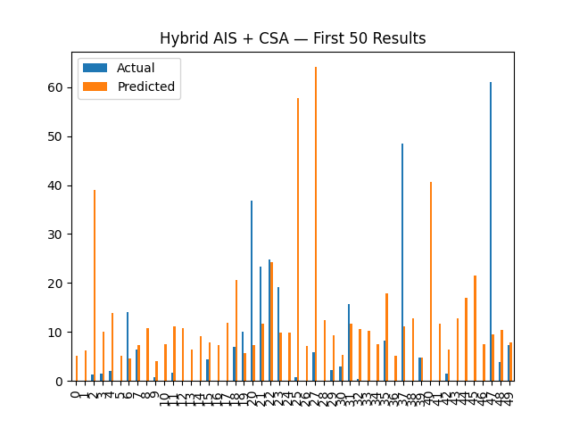

🔥 FireLens — Hybrid AIS + CSA Wildfire Prediction System
AI-Powered Wildfire Risk Forecasting using Hybrid Artificial Immune System + Cuckoo Search Optimization
📌 Overview

FireLens is an intelligent wildfire prediction system designed to forecast wildfire ignition risk using meteorological, vegetation, and environmental data.

This implementation uses:

Hybrid AIS (Artificial Immune System)

CSA (Cuckoo Search Algorithm)

Deep Learning Model (MLP)

forestfires.csv Dataset

The hybrid optimizer enhances model accuracy by exploring a wide hyperparameter space and applying immune-inspired mutation and cuckoo-based exploration.

🎯 Objective

To build a high-accuracy wildfire ignition prediction system using optimized machine learning, and save:

Trained model (.h5)

Scaler (.pkl)

Best configuration (.yaml)

Prediction output (.json)

Result CSV (.csv)

All graphs (.png)

With hybrid_ prefix for easy identification.

📁 Dataset Used

Dataset Path:

C:\Users\NXTWAVE\Downloads\Wildfire Prediction\archive\forestfires.csv

Features include:

Meteorological: temp, wind, RH

Vegetation dryness: FFMC, DMC, DC, ISI

Spatial data: X, Y grid location

Temporal: month, day

Target: area burned (proxy for fire severity)

⚙️ Model Architecture
🔧 Deep Learning (MLP)

Dense Layer (32–128 units)

Dropout Layer (0.1–0.4)

Dense Layer (16–64 units)

Dropout Layer (0.1–0.4)

Output Layer (1 neuron, linear)

🚀 Hybrid Optimization (AIS + CSA)
AIS (Artificial Immune System)

Clonal selection

Mutation

Antibody (hyperparameter) diversity

CSA (Cuckoo Search Algorithm)

Lévy flight jumps

Randomized hyperparameter jumps

Best nest survival strategy

Together, they optimize:

Hidden layer units

Dropout rate

Learning rate

Batch size

📦 Generated Output Files

All saved in:

C:\Users\NXTWAVE\Downloads\Wildfire Prediction

🔹 Model & Config
File	Description
hybrid_firelens_model.h5	Trained AIS+CSA optimized model
hybrid_firelens_scaler.pkl	MinMaxScaler used for preprocessing
hybrid_firelens_config.yaml	Best optimizer parameters found
🔹 Prediction & Results
File	Description
hybrid_firelens_result.csv	Actual vs Predicted values
hybrid_firelens_prediction.json	JSON formatted predictions
🔹 Visualization Graphs

Saved inside:

visuals/

File Name	Description
hybrid_firelens_heatmap.png	Correlation heatmap
hybrid_firelens_loss.png	Loss curve
hybrid_firelens_comparison.png	Actual vs Predicted
hybrid_firelens_results.png	First 50 sample bar plot
hybrid_firelens_prediction_graph.png	Scatter plot
📊 Performance Metrics

FireLens outputs:

RMSE (Root Mean Square Error)

Loss curve

Comparison graphs

Scatter prediction plots

These help evaluate prediction quality.

🚀 How It Works (Flow)
1️⃣ Data Preprocessing

Load CSV

Encode categorical (month, day)

Normalize using MinMaxScaler

2️⃣ Hybrid Optimization

AIS generates clones + mutates them

CSA executes Lévy jumps on parameters

Fitness = RMSE of prediction

Best solution carried forward

3️⃣ Final Model Training

Uses best parameters

Trained for 50 epochs

Model saved as .h5

4️⃣ Predictions & Graphs

Generates CSV + JSON

Creates all graphs

Stores everything with hybrid_ prefix

🏗️ Project Structure
Wildfire Prediction/
│── archive/
│   └── forestfires.csv
│── hybrid_firelens_model.h5
│── hybrid_firelens_scaler.pkl
│── hybrid_firelens_config.yaml
│── hybrid_firelens_result.csv
│── hybrid_firelens_prediction.json
│── visuals/
│   ├── hybrid_firelens_heatmap.png
│   ├── hybrid_firelens_loss.png
│   ├── hybrid_firelens_comparison.png
│   ├── hybrid_firelens_results.png
│   ├── hybrid_firelens_prediction_graph.png
└── hybrid_firelens_main.py   (your code file)

🔮 Applications & Use-Cases

FireLens can be used in:

Forest fire early-warning systems

Smart city disaster monitoring

Land management & forest departments

Environmental impact research

Weather-integrated fire modeling

🔧 Requirements
Python 3.7+
TensorFlow 2.x
NumPy
Pandas
Scikit-learn
Matplotlib
Seaborn
PyYAML
Joblib

Install all at once:

pip install numpy pandas scikit-learn matplotlib seaborn tensorflow pyyaml joblib

📝 How to Run

Simply run the Python script:

python hybrid_firelens_main.py

All output will be automatically generated.

🏁 Conclusion

This project demonstrates:

✔ Hybrid optimization (AIS+CSA)
✔ Advanced wildfire prediction
✔ Automated ML pipeline
✔ Complete visualization suite
✔ Deployment-ready model

FireLens is modular and easily extendable to:

CNN-based image wildfire detection

Satellite data integration

IoT sensor fusion

Smoke spread modeling

Real-time dashboards
